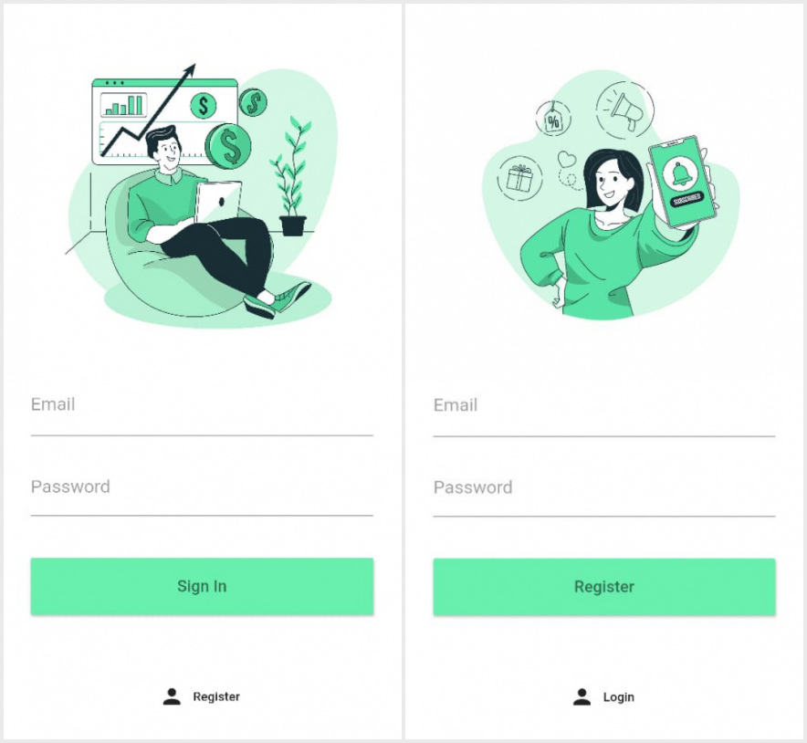

# Login Page With Firebase

## Welcome

That's a simple app I developed just for training

#### Features

- Firebase Auth Integration
- Login with Email and Password
- Login with anonymous mode
- Logout functionality
- Register with email and password
- List your phone contacts

#### Screens

- Login Screen
- Sign Up Screen
- Your Contacts

If you wanna run the app in your machine/device, you must put your own **google-services.json** file inside the **android/app** folder and then run the **main.dart** file
